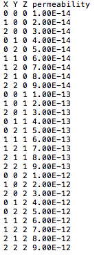
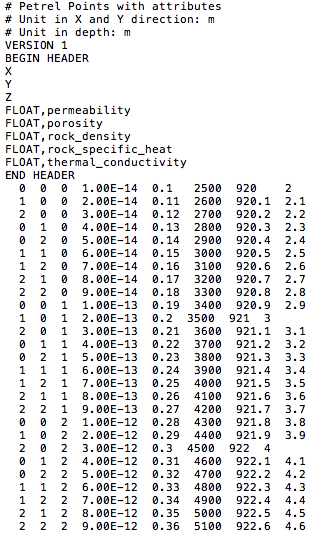
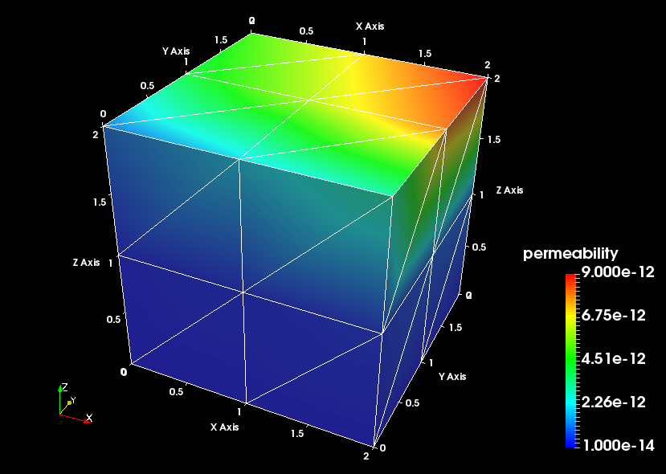
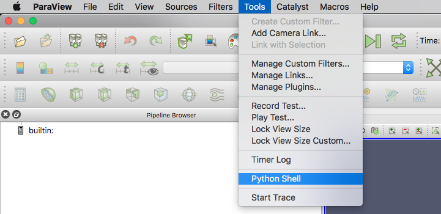
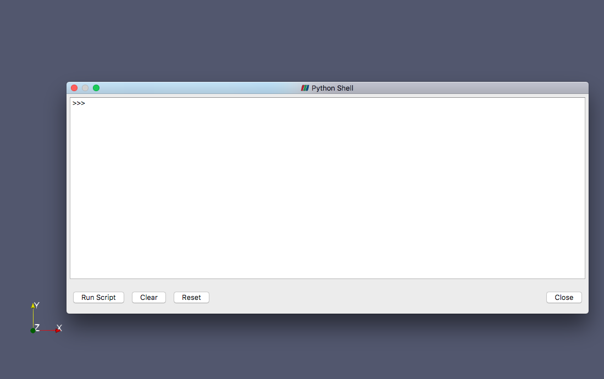
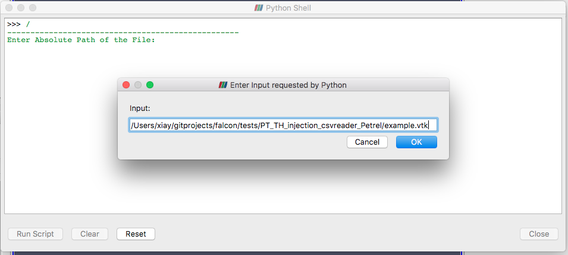
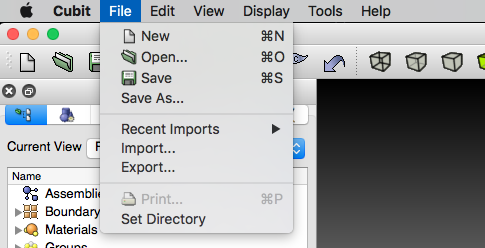
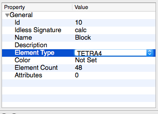

# A Workflow of Tetrahedral Mesh Generation with Nodal Attributes from a Point Cloud

## Developers ##

* Miu-Lun (Andy) Lau
* Yidong Xia

## Introduction

This document describes a workflow of how to generate a tetrahedral mesh with nodal attributes from a point cloud. In reservoir engieering, it is flexible to use a tetrahedral mesh for representing a geological subsurface domain, and  the nodal attributes in a mesh can be used to represent __material properties__ of interest, e.g., permeability, porosity, rock density and thermal conductivity. Usually, those properties can be provided from the output of reservoir modeling software (e.g. [RockWorks](https://www.rockware.com/product/overview.php?id=165) or [Petrel](https://www.software.slb.com/products/petrel)) in the form of (x, y, z) node coordinates with nodal attributes.

The workflow consists of two parts:

* **Part 1. From Point Cloud to VTK Mesh** describes the generation of a VTK mesh from a point cloud.

* **Part 2. From VTK Mesh to Exodus Mesh** describes the conversion from a VTK mesh to an Exodus mesh.

Currently **Part 1** is automated with a Python script, whereas **Part 2** mostly invovles manual operation. Automation of **Part 2** will be developed in future.

## Prerequisites

A list of software packages required in this workflow is as below:

* [Python](https://www.python.org/downloads/) (Version 2.7.2)
* C++ compiler
* [TetGen](http://wias-berlin.de/software/tetgen/) (Version 1.5)
* [ParaView](https://www.paraview.org/)
* [Cubit](https://cubit.sandia.gov)

### Compile TetGen

In this workflow, the open-source mesh generator TetGen is used to generate a VTK tetrahedral mesh containing nodal attributes from a point cloud. The FALCON repository provides the source code of TetGen in directory __falcon/tpl/tetgen/__. In the command-line window, navigate to directory __falcon/tpl/tetgen/__, and enter the command

```
make
```
to compile the source code and generate an executable file __falcon/tpl/tetgen/tetgen__. Users do not need to call TetGen directly by themselves. Instead, TetGen is called in a Python script __falcon/scripts/points2tets.py__. The GNU C++ compiler **g++** is the default compiler in file __falcon/tpl/tetgen/makefile__; see line 14:

```
CXX = g++
```

## Workflow Part 1: From Point Cloud to VTK Mesh

Two examples can be found in FALCON repository: one is to start from *RockWorks* data, and the other is to start from *Petrel* data.


### Example: Start from *RockWorks* Data 

__example.permeability.txt__ (ROCKWORKS)



Follow the steps:

* Navigate to directory __falcon/tests/PT\_TH\_injection\_csvreader\_RockWorks__, and enter the command:

```
../../scripts/generate_vtk_tet_mesh_from_point_cloud.sh
```

* Enter __1__ at the prompt:

```
----------------------------------------------------------------------
[1] ROCKWORKS OR [2] PETREL
ENTER FORMAT:
```

* Enter __example.permeability.txt__ at the prompt:

```
Enter Input File Name:
```

* A tetrahedral mesh file named __example.vtk__ is generated at the end.

Note:

* __example.permeability.txt__ is one of the five *RockWorks* data files in the directory, with the other four named __example.porosity.txt__, __example.rock\_density.txt__, __example.rock\_specific\_heat.txt__ and __example.thermal\_conductivity.txt__. They have to be individual files because *RockWorks* outputs them individually.

* Each data file contains only one type of nodal material property, as indicated by the file names. In each file, the data  looks like *`<x> <y> <z> <attribute>`* in each line. 

* It is OK to enter any of the five file names, because the Python script will read through all files named in the form of __example.*.txt__. The resulting __example.vtk__ file contains all the five sets of material properties.

* Users are responsible for ensuring that such a file is provided in the correct format.

### Example: Start from *Petrel* Data

__example.txt__ (PETREL)



Follow the steps:

* Navigate to directory __falcon/tests/PT\_TH\_injection\_csvreader\_Petrel__, and enter the command:

```
../../scripts/generate_vtk_tet_mesh_from_point_cloud.sh
```

* Enter __2__ at the prompt:

```
----------------------------------------------------------------------
[1] ROCKWORKS OR [2] PETREL
ENTER FORMAT:
```

* Enter __example.txt__ at the prompt:

```
Enter Input File Name:
```

* A tetrahedral mesh file named __example.vtk__ is generated at the end.

Note:

* __example.txt__ is a *Petrel* data file containing five sets of nodal material properties: __permeability__, __porosity__, __rock\_density__, __rock\_specific\_heat__ and __thermal\_conductivity__.

* Users are responsible for ensuring that such a file is provided in the correct format.

This is the result of the output file


## Workflow Part 2: VTK Mesh to Exodous Mesh

To convert a VTK Mesh to Exodous, a script has been prepared to automate the conversion from **example.vtk** to **example.e** and **example.csv**. To use the automated script:

* First, open ParaView, and navigate to **Tools** and **Python Shell**,



* Then open a new window in the python shell. From there choose **Run Scripts**,



* The script is located in **falcon/scripts/paraview2exodus.py**. After that, the console will ask for input file as shown below. 



* If the script run sucessfully, it should be similar to the figure below.


* Paste the path to the input window, e.g., **/Users/xiay/gitprojects/falcon/tests/PT\_TH\_injection\_csvreader\_Petrel/example.vtk**, and click OK. An Exodus file will be generated in the same directory, i.e., **/Users/xiay/gitprojects/falcon/tests/PT\_TH\_injection\_csvreader\_Petrel/example.e**.

* Since **example.e** does not contain any Sideset info, we will need to assign Sideset IDs in Cubit. Open Cubit, and select **File** and import **"example.e"**.



* To assign SideSet IDs, click on the Yellow Cube on the command toolbar, and choose **exodus sideset**


* Follow the table below to set all SideSet IDs

| SideSet IDs Number|Corrpsonding Facet|
|:-----------------:|:----------------:| 
| 1                 | X-min            | 
| 2                 | X-max            | 
| 3                 | Y-min            |
| 4                 | Y-max            |
| 5                 | Z-min            |
| 6                 | Z-max            | 

* After that, we need to change the element type from **TETRA** to **TETRA4**. To do that, expand **Blocks** on the powertools on the right, 


* Choose the Block (Default is Block 10) and change the Element type to **TETRA4** .



* At the end, there should be two files if you follow all the steps above:

	* **"example.e"** contains an Exodus mesh file with Subset IDs, but without any nodal material properties. FALCON reads this file in the [mesh] keyword block in the FALCON input script.
	* **"example.csv"** is a CSV file containing the nodal material properties. FALCON reads this file in the [VectorPostprocessors] keyword block.

### Side Note: 

* Conversion from **example.vtk** to **example.e** and **example.csv** occurs inside the ParaView GUI python shell. Fully automated process through command-line terminal had been explored. However errors were encountered on different operating systems. By using python shell inside ParaView GUI client, it can guarantee compatibility across different ParaView versions and operating systems.
* Additional scripting has been developed for **example.csv**, because the underlying MOOSE's CSV reader does not accept double-quotes on the header of file.